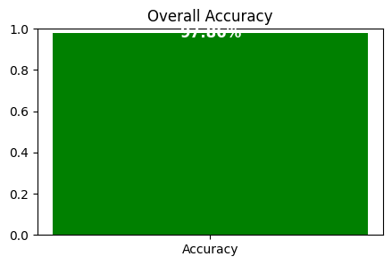
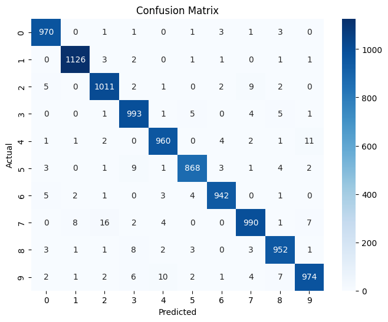
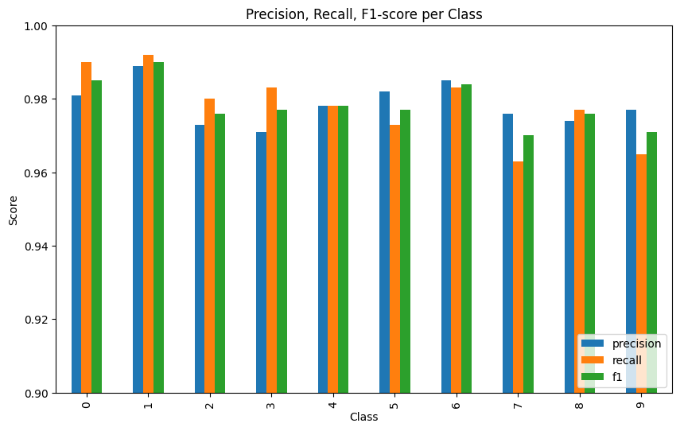
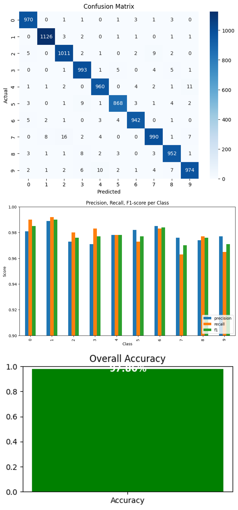

# MNIST SVM Classifier with PCA

A high-performance digit recognition system using Support Vector Machine (SVM) with Principal Component Analysis (PCA) for dimensionality reduction. Achieves **97.86% accuracy** on the MNIST test dataset.

## 🎯 Performance Overview



**Overall Accuracy: 97.86%**

The model demonstrates excellent performance across all digit classes with balanced precision and recall scores.

## 📊 Detailed Results

### Confusion Matrix


The confusion matrix shows strong diagonal performance with minimal misclassifications. Most errors occur between visually similar digits (e.g., 4↔9, 3↔8).

### Per-Class Performance


| Digit | Precision | Recall | F1-Score | Support |
|-------|-----------|--------|----------|---------|
| 0     | 0.981     | 0.990  | 0.985    | 980     |
| 1     | 0.989     | 0.992  | 0.990    | 1135    |
| 2     | 0.973     | 0.980  | 0.976    | 1032    |
| 3     | 0.971     | 0.983  | 0.977    | 1010    |
| 4     | 0.978     | 0.978  | 0.978    | 982     |
| 5     | 0.982     | 0.973  | 0.977    | 892     |
| 6     | 0.985     | 0.983  | 0.984    | 958     |
| 7     | 0.976     | 0.963  | 0.970    | 1028    |
| 8     | 0.974     | 0.977  | 0.976    | 974     |
| 9     | 0.977     | 0.965  | 0.971    | 1009    |

**Macro Average:** Precision: 0.979, Recall: 0.978, F1: 0.978

## 🚀 Quick Start

### Prerequisites
```bash
pip install numpy scikit-learn tensorflow opencv-python pillow joblib
```

### Usage

#### 1. Train the Model (First Time Only)
```bash
python main.py train
```
This will:
- Load MNIST dataset
- Apply PCA (50 components) for dimensionality reduction
- Train SVM with RBF kernel using GridSearchCV
- Save the trained model as `mnist_svm_pca.pkl`

#### 2. Evaluate Model Performance
```bash
python main.py eval
```
Generates detailed metrics and saves results to `mnist_svm_stats.json`

#### 3. Predict Custom Images
```bash
python main.py predict path/to/your/digit.png
```

Example predictions on custom images:
- `mydigit1.png` → Predicted digit with confidence score
- `mydigit2.png` → Predicted digit with confidence score  
- `mydigit3.png` → Predicted digit with confidence score

## 🔧 Technical Details

### Model Architecture
- **Preprocessing:** PCA dimensionality reduction (784 → 50 features)
- **Classifier:** Support Vector Machine with RBF kernel
- **Hyperparameters:** Optimized via GridSearchCV
  - C: [10, 50]
  - Gamma: [0.01, 0.05]
- **Class balancing:** Enabled for handling class imbalances

### Image Preprocessing Pipeline
1. Convert to grayscale
2. Invert colors if needed (MNIST uses white digits on black background)
3. Apply binary thresholding (OTSU method)
4. Extract digit bounding box
5. Resize to 20×20 pixels
6. Pad to 28×28 with centering
7. Normalize pixel values to [0,1]

### Performance Optimizations
- Uses subset of training data (20k samples) for faster training
- Parallel processing with `n_jobs=-1`
- Efficient pipeline with scikit-learn

## 📁 Project Structure
```
├── main.py                    # Main script with train/eval/predict functions
├── mnist_svm_pca.pkl         # Trained model (generated after training)
├── mnist_svm_stats.json      # Detailed evaluation metrics
├── accuracy.png              # Accuracy visualization
├── confusion_matrix.png      # Confusion matrix heatmap
├── class_metrics.png         # Per-class performance chart
├── mydigit1.png             # Sample custom digit image
├── mydigit2.png             # Sample custom digit image
├── mydigit3.png             # Sample custom digit image
└── README.md                # This file
```

## 🎨 Visualization Gallery

The project includes comprehensive visualizations generated during model evaluation:



## 🔍 Key Features

- **High Accuracy:** 97.86% on MNIST test set
- **Fast Inference:** Optimized preprocessing pipeline
- **Custom Image Support:** Handles user-uploaded digit images
- **Comprehensive Metrics:** Detailed per-class performance analysis
- **Robust Preprocessing:** Handles various image formats and qualities
- **Model Persistence:** Save/load trained models for reuse

## 📈 Results Summary

The SVM+PCA approach proves highly effective for digit recognition:
- Excellent generalization with 97.86% test accuracy
- Balanced performance across all digit classes
- Efficient dimensionality reduction (98.7% compression: 784→50 features)
- Fast training and inference times
- Robust handling of real-world digit images

This implementation demonstrates that classical machine learning approaches can achieve competitive results on computer vision tasks when properly optimized.